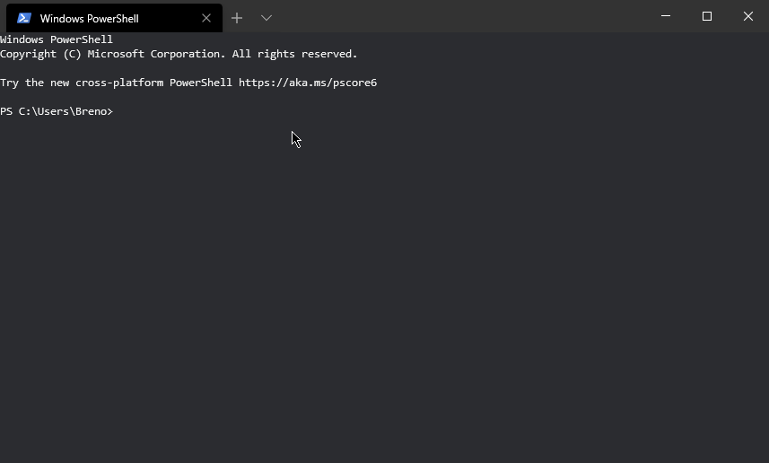

# Handful Generator 🤝

## What is this???? 🤔

This is a project/package for creating premounted projects for fast startUp 

## Templates 📘

### JavaScript Express API

The JS Express API provides a simple API base for Restfull services with:

* [X] Jest config files
* [X] eslint
* [X] dockerfiles
* [ ] Kube files
* [ ] Build bundles

### TypeScript Express API

The TS Express API provides a simple API base for Restfull services using Typescript with:

* [X] Jest config files
* [X] eslint
* [X] dockerfiles
* [ ] Kube files
* [X] Build bundles (for js files)

The compiler used is `tsc` along side the `tsconfig.json` file

## Usage 👩‍💻👨‍💻

Just a simple `npx hanful-generator` then select the option you desire and the folder name and you're done!!🎉🎉🎉
