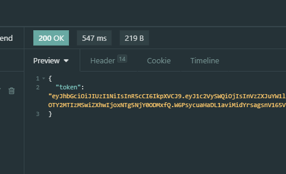

# TypeScript Express API Base

## Install
`npm i`

## Build

`npm run build`

## Run dev

`npm run dev`

## Run Prod

`npm start`

## Test

`npm test`

## Lint

For this project is used the [Airbnb](https://github.com/airbnb/javascript) Coding style

## Test

For running tests just `npm test` here some [considerations](https://dev.to/nedsoft/testing-nodejs-express-api-with-jest-and-supertest-1km6)

## Database

This projects uses the [TypeORM](https://typeorm.io/#/) Database for operations with persistant models

## Start Using it 🙌

### Install All dependencies

`npm i`

Make sure you have eslint configure right on your VSCode

### Configure the database

In the ormconfig.json you can confingure your connections

### Sync your models

To get your database up and running you can run `npm run db:sync` then it will load all the tables to your database

### Run migrations

To populate your database you can run `npm run db:migrate` then it will load all your migrations into the database

### Run dev mode

To run it in dev mode with Nodemon - already configured. Just run `npm run dev` and it will boot up a development server watching for files in the src/ directory

## Auth and Token

This template has a express limit api so for user routes it limits the request for a pre determined time, if the user reaches it, it gets a `429` and the token gets revoked in the tokens table.

For the auth route, it has a throttle down logic that increases the response time in 100ms after the reqs limit 

`**CONSIDER USING MONGO OR REDIS DISTRIBUTED FOR TOKEN CONTROL AND CRONJON TO CLEAN THE DATABASE FOR TOKENS THAT ARE EXPIRED ( USE ENV FOR SETTING THE TIME FOR EXPIRE AND CONJOB TO CLEANUP THE DB)**`

